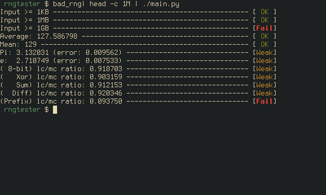

# RNG Tester

A framework and series of tests for testing statistical randomness.

It tests for raw bytes of uncorrilated uniformly distributed
randomness. I wrote mainly for testing some of my own toy ciphers. Its
not very extensive but it allows me to distinguish some own my toy
ciphers I haven't cracked yet from actually secure ciphers.

# Usage

    some_process_that_outputs_data | ./main.py

For accurate results use at least 1GB of input data. Good random
number generator may occasionally fail at some test but bad random
number generators should consistantly fail at the tests.
